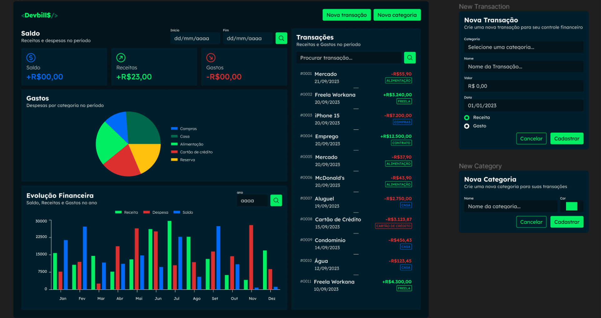
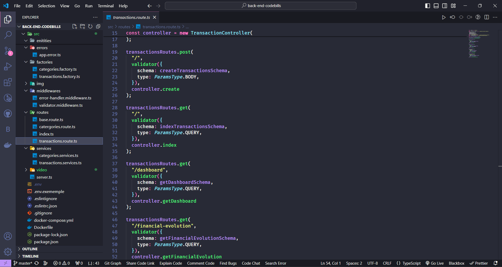
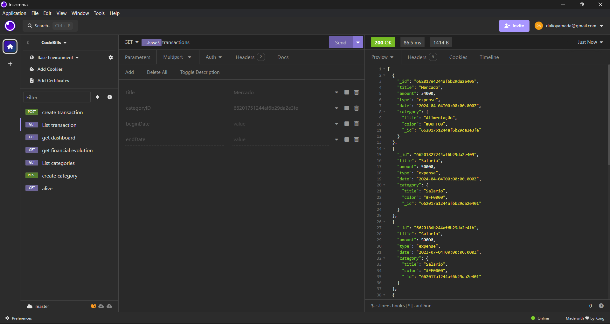
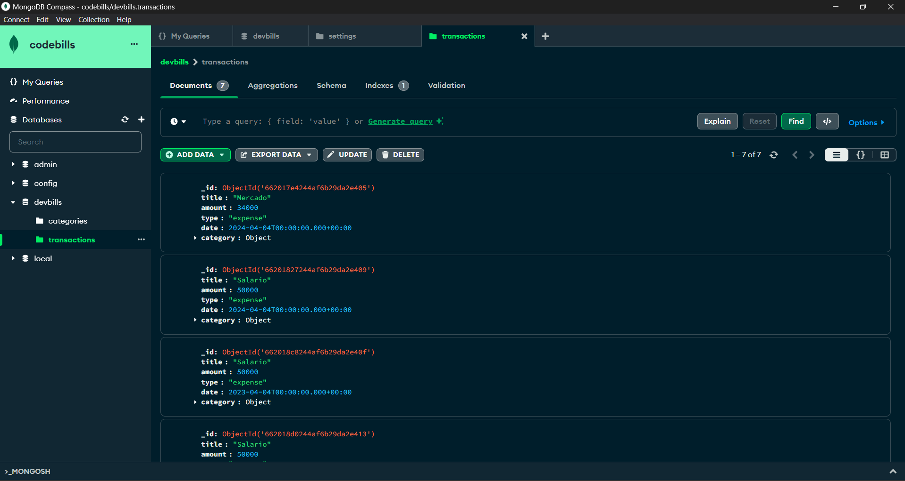
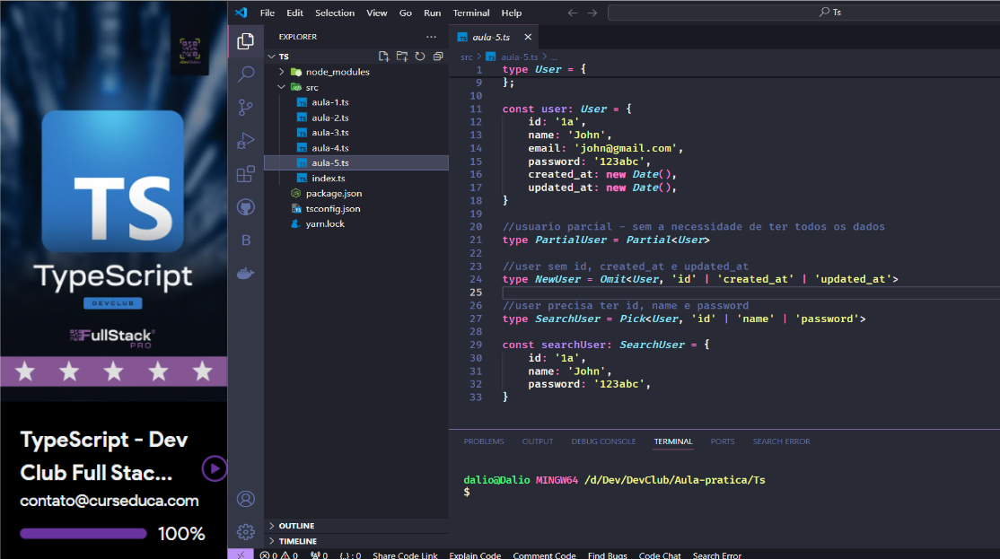

<h1 align="center">Back-End CodeBills</h1>

<h2>Olá sejam bem-vindo</h2>

💸Controle Financeiro com TypeScript: Uma API incrível

Gostaria de compartilhar com vocês a jornada incrível que tive ao desenvolver um projeto de controle financeiro com a ajuda do curso DevClub. Essa experiência foi muito gratificante e me permitiu aprofundar meus conhecimentos em diversas tecnologias, além de me proporcionar o aprendizado de novas habilidades essenciais para o mercado de trabalho.

<h4>O Desafio:</h4>

O objetivo principal do projeto foi criar uma API e escalável para gerenciar finanças pessoais, proporcionando aos usuários uma ferramenta completa para controlar seus ganhos e gastos.

<h4>Tecnologias:</h4>
<ul>
<li>🟦TypeScript: Uma linguagem de programação que me permitiu escrever código mais seguro, organizado e eficiente.</li>
<li>🌱MongoDB: Um banco de dados NoSQL que facilitou o armazenamento e a consulta de dados de forma flexível e escalável.</li>
<li>🐳Docker: Uma plataforma de containerização que simplificou a implantação e o gerenciamento da aplicação em diferentes ambientes.</li>
<li>✒️ Insomnia: Uma ferramenta de teste de API que me auxiliou na validação e no refinamento das chamadas à API.</li>
</ul>

Ao longo do desenvolvimento do projeto, tive a oportunidade de aprofundar meus conhecimentos em cada uma das tecnologias utilizadas.

<h4>Link:</h4>

> PORTFÓLIO: https://daliosy.github.io/PORTFOLIO

> Repoditório: https://github.com/DalioSY/back-end-codebills

> Linkedin: https://www.linkedin.com/in/dalio-s-yamada/

#ControleFinanceiro #HTML #CSS #JavaScript #Github #React.js #Typescript #Node.js #Api #Express #Sequelize #Postgresql #Docker #Front-End #Back-End #FullStack #Programador #Dev #Web #Desenvolvedor-Web #DesenvolvedorFront-End #DesenvolvedorBack-End #DesenvolvedorFull-Stack #TransiçãoDeCarreira #jornadaproficional #aprendendo #tecnologia #openToWork #Recruiter

 

  <ul align="center">
    <h2 style="display: inline-block">Imagens:</h2>
  </ul>

 
  
  
  
  
  
  

